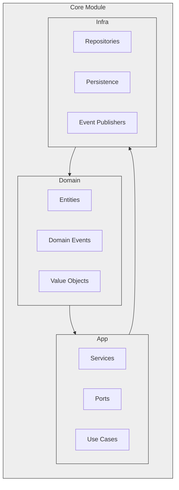

# ProjectHub


**A comprehensive platform for managing student projects, component evaluations, and project distribution, built with JavaFX, Spring Boot, and PostgreSQL.**

[](https://openjfx.io/)
[](https://spring.io/projects/spring-boot)
[](https://www.postgresql.org/)
[](https://github.com/bilalobe/ProjectHub/actions/workflows/dependabot/dependabot-updates)
[](https://github.com/bilalobe/ProjectHub/actions/workflows/qodana_code_quality.yml)
[](https://github.com/bilalobe/ProjectHub/actions/workflows/codeql.yml)
[](https://www.rabbitmq.com/)
[](https://graphql.org/)


<!-- New Badges Added Below -->

[](https://github.com/bilalobe/ProjectHub/issues)
[](https://github.com/bilalobe/ProjectHub/pulls)
[](https://github.com/bilalobe/ProjectHub/stargazers)
[](https://github.com/bilalobe/ProjectHub/network/members)

[](https://opensource.org/licenses/MIT)

## Overview

ProjectHub is a powerful and intuitive platform designed to streamline the management of student projects, facilitate component evaluations, and simplify project distribution. It offers a rich desktop experience through JavaFX and a responsive web interface with Angular, backed by a robust Spring Boot backend and PostgreSQL database.

## Features

- **Project Creation and Management**: Easily create, edit, and manage student projects. Assign projects to teams, define deadlines, and specify requirements.
- **Component Evaluation**: Evaluate project components that contribute to final deliverables. Ensure quality submissions with an integrated evaluation system.
- **Team Collaboration**: Teams can view project details, submit project components, and track their submissions.
- **Secure Authentication**: Robust user authentication mechanisms to protect data and ensure secure access.
- **Plugin Support**: Extend functionality with plugins, such as the CSV plugin for data import/export.
- **Cross-Platform Availability**: Access ProjectHub via the desktop client or the web interface.
- **Domain-Driven Design**: Built using DDD principles with clear bounded contexts
- **Event-Driven Architecture**: Async event processing via RabbitMQ
- **Spring Modulith**: Modular monolith architecture
- **Secure by Design**: Role-based access control with Spring Security
- **Rich Desktop Client**: JavaFX-based UI with reactive bindings
- **GraphQL API**: Netflix DGS framework for flexible data queries
- **Validation Chains**: Comprehensive input validation and error handling
- **Event Sourcing**: Track all changes with versioned events

## Architecture

ProjectHub follows a modular architecture to promote scalability and maintainability:

- **Backend**: Built with Spring Boot, providing RESTful APIs and business logic.
- **Frontend Web Interface**: Developed with Angular, offering a responsive and interactive user experience.
- **Desktop Client**: Implemented using JavaFX for a rich desktop experience.
- **Database**: Utilizes PostgreSQL for reliable and efficient data storage.
- **Plugins**: Supports plugins to enhance and extend core functionalities.

ProjectHub implements a modular monolith using Spring Modulith:



## Getting Started

### Prerequisites

- **Java Development Kit (JDK) 21** or higher
- **Node.js** and **npm** (for the Angular frontend)
- **PostgreSQL** database
- **Gradle** build tool (included via Gradle Wrapper)

### Installation

#### Clone the Repository

```bash
git clone https://github.com/bilalobe/ProjectHub.git
cd ProjectHub
```

#### Database Setup

1. **Install PostgreSQL** if not already installed.
2. **Create a new database** named `projecthub`:

   ```sql
   CREATE DATABASE projecthub;
   ```

3. **Configure Database Connection**:

   Update the database connection settings in 

application.properties

 or `application.yml`:

   ```properties
   spring.datasource.url=jdbc:postgresql://localhost:5432/projecthub
   spring.datasource.username=your_db_username
   spring.datasource.password=your_db_password
   ```

### Running the Application

#### Backend (Spring Boot Application)

1. Navigate to the app directory:

   ```bash
   cd base
   ```

2. Build and run the application:

   ```bash
   ./gradlew bootRun
   ```

   The backend server will start on `http://localhost:8080`.

#### Frontend (Angular Application)

1. Open a new terminal and navigate to the frontend directory:

   ```bash
   cd frontend
   ```

2. Install dependencies:

   ```bash
   npm install
   ```

3. Run the development server:

   ```bash
   ng serve
   ```

   Access the web interface at `http://localhost:4200`.

#### Desktop Client (JavaFX Application)

1. Ensure the backend is running.
2. Run the JavaFX application:

   ```bash
   cd desktop-ui
   ./gradlew run
   ```

## Usage

- **Access the Web Interface**: Navigate to `http://localhost:4200` in your web browser.
- **Desktop Client**: Launch the JavaFX application as described above.
- **API Documentation**: Access API endpoints and documentation at `http://localhost:8080/swagger-ui.html` (if Swagger is configured).
- **User Accounts**: Register a new user or log in with your credentials to access features based on your role (e.g., Teacher, Student).

## Contributing

We welcome contributions! Please read our Contributing Guidelines to get started.

- **Report Issues**: Use the [GitHub Issues](https://github.com/yourusername/ProjectHub/issues) page to report bugs or request new features.
- **Code of Conduct**: Please adhere to our Code of Conduct to maintain a welcoming community.

## Security Policy

For information on supported versions and reporting vulnerabilities, please refer to our Security Policy.

## License

ProjectHub is licensed under the MIT License.

## Contact

For questions, support, or further information, please contact:

- **Email**: [support@projecthub.com](mailto:support@projecthub.com)
- **Project Repository**: [GitHub - ProjectHub](https://github.com/bilalobe/ProjectHub)
