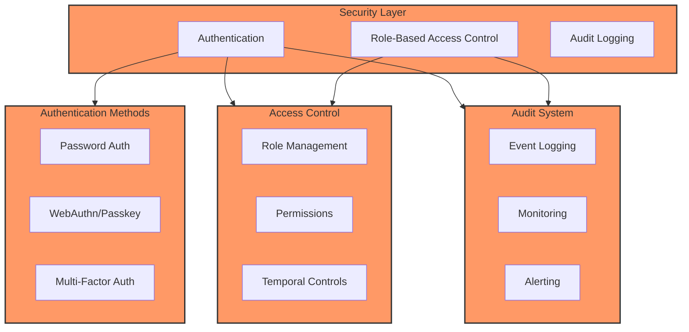

# Security Policy

## Supported Versions

We currently support the following versions of ProjectHub with security updates:

| Version | Supported          | EOL Date    |
| ------- | ----------------- | ----------- |
| 2.x.x   | :white_check_mark: | TBD         |
| 1.x.x   | :x:               | 2024-12-31  |

## Security Features

ProjectHub implements enterprise-grade security features:

### 1. Authentication

- **Multi-factor Authentication**
  - Password-based authentication
  - WebAuthn/Passkey support (FIDO2)
  - Time-based One-Time Password (TOTP)
  
- **Password Security**
  - Argon2id password hashing
  - Configurable password policies
  - Account lockout protection
  - Password history enforcement

### 2. Authorization

- **Role-Based Access Control (RBAC)**
  - Apache Fortress ANSI INCITS 359-2004 implementation
  - Hierarchical role structures
  - Dynamic separation of duties (SoD)
  - Temporal access constraints

- **Access Control**
  - Attribute-based access control (ABAC)
  - Resource-level permissions
  - IP-based restrictions
  - Geolocation controls

### 3. Audit & Compliance

- **Audit Logging**
  - Comprehensive action logging
  - User session tracking
  - Failed authentication attempts
  - Role and permission changes

- **Compliance Features**
  - GDPR compliance tools
  - Data retention policies
  - Audit trail exports
  - Privacy controls

## Reporting a Vulnerability

We take security vulnerabilities seriously. Please follow these steps to report a vulnerability:

1. **DO NOT** create a public GitHub issue for security vulnerabilities.

2. Send a detailed report to [security@projecthub.com](mailto:security@projecthub.com) including:
   - Description of the vulnerability
   - Steps to reproduce
   - Potential impact
   - Suggested mitigation (if any)

3. You should receive a response within 48 hours acknowledging receipt.

4. Our security team will investigate and provide regular updates.

5. Once resolved, we will:
   - Release a security patch
   - Credit you in our security advisory (if desired)
   - Add the fix to our security changelog

## Security Best Practices

### For Administrators

1. **Initial Setup**
   ```bash
   # Generate a secure encryption key
   ./gradlew generateEncryptionKey
   
   # Initialize security configuration
   ./gradlew initSecurityConfig
   
   # Verify security settings
   ./gradlew verifySecurityConfig
   ```

2. **Regular Maintenance**
   - Rotate encryption keys every 90 days
   - Review audit logs weekly
   - Update security patches promptly
   - Backup security configurations

3. **Monitoring**
   - Enable intrusion detection
   - Monitor failed login attempts
   - Track unusual access patterns
   - Review role assignments monthly

### For Developers

1. **Development Environment**
   - Use security-focused IDE plugins
   - Enable security linting
   - Run SAST scans regularly
   - Follow secure coding guidelines

2. **Code Review**
   - Mandatory security review for auth changes
   - Use secure dependencies only
   - Follow OWASP Top 10 guidelines
   - Implement security testing

### For Users

1. **Account Security**
   - Use strong passwords
   - Enable WebAuthn/passkeys
   - Keep recovery codes safe
   - Report suspicious activity

2. **Access Management**
   - Use principle of least privilege
   - Regular access review
   - Report access issues
   - Follow security training

## Security Architecture



## Compliance & Certifications

- SOC 2 Type II (in progress)
- ISO 27001 (planned)
- GDPR compliant
- CCPA compliant

## Security Tools & Dependencies

- Apache Fortress Core 3.0.0
- Spring Security 6.x
- Yubico WebAuthn Server 2.5.0
- Argon2 Password Hashing
- OWASP Security Headers
- Security Event Monitoring

## Regular Security Assessment

We conduct regular security assessments:

1. **Monthly**
   - Dependency vulnerability scans
   - Security patch reviews
   - Access control audits

2. **Quarterly**
   - Penetration testing
   - Security configuration review
   - Compliance assessment

3. **Annually**
   - Full security audit
   - Policy review
   - Certification renewal

## Incident Response

In case of a security incident:

1. **Immediate Response**
   - Isolate affected systems
   - Notify security team
   - Begin incident documentation

2. **Investigation**
   - Analyze breach scope
   - Collect forensic data
   - Determine root cause

3. **Resolution**
   - Implement fixes
   - Update security measures
   - Notify affected users

4. **Post-Incident**
   - Review incident response
   - Update security policies
   - Implement preventive measures

## Security Changelog

All security-related changes are documented in our [Security Changelog](SECURITY-CHANGELOG.md).

## Contact

- Security Email: [security@projecthub.com](mailto:security@projecthub.com)
- Security Team Lead: [securitylead@projecthub.com](mailto:securitylead@projecthub.com)
- Bug Bounty Program: [https://projecthub.com/security/bounty](https://projecthub.com/security/bounty)
