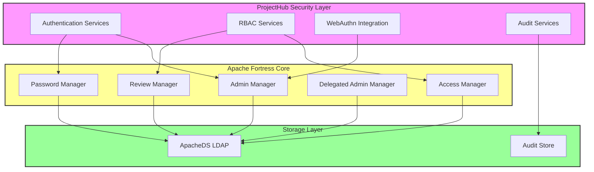
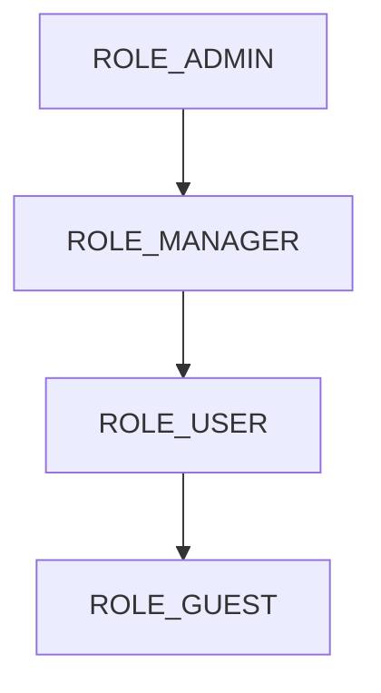
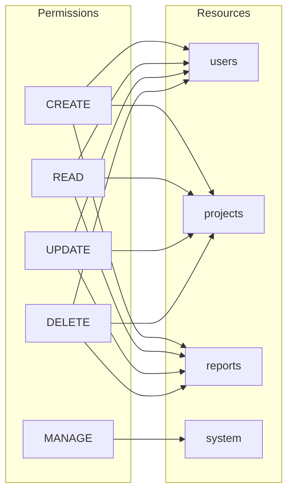

# Apache Fortress Integration Guide

## Architecture Overview

ProjectHub uses Apache Fortress as its core security provider, implementing ANSI INCITS 359-2004 RBAC standards. This guide covers integration details, security patterns, and operational procedures.



## Integration Components

### 1. Authentication Services

- `FortressAuthenticationProvider`: Main authentication provider
- `FortressUserDetailsService`: User details and session management
- `FortressPasswordService`: Password policy enforcement
- `FortressPasskeyService`: WebAuthn/passkey integration

### 2. Authorization Services

- `FortressAccessControlService`: Permission checks and RBAC
- `FortressMethodSecurityExpressionHandler`: Method-level security
- `FortressSecurityExpressionRoot`: Security expressions

### 3. User Management

- `FortressUserManagementService`: User CRUD operations
- `FortressBootstrapService`: Initial security setup
- `FortressAuditService`: Security event logging

## Configuration Guide

### 1. Dependencies

Add to your `build.gradle`:

```gradle
dependencies {
    // Core Fortress dependencies
    implementation 'org.apache.directory.fortress:fortress-core:3.0.0'
    implementation 'org.apache.directory.fortress:fortress-realm-impl:3.0.0'
    
    // WebAuthn support
    implementation 'com.yubico:webauthn-server-core:2.5.0'
    
    // Spring Security integration
    implementation 'org.springframework.security:spring-security-core'
    implementation 'org.springframework.security:spring-security-web'
    implementation 'org.springframework.security:spring-security-config'
}
```

### 2. LDAP Configuration

Configure ApacheDS in `docker-compose-apacheds.yml`:

```yaml
version: '3.8'
services:
  apacheds:
    image: apache/directory-server:2.0.0.AM26
    ports:
      - "10389:10389"
    volumes:
      - ./ldap/instances:/var/lib/apacheds-2.0.0
    environment:
      - ADS_ADMIN_DN=uid=admin,ou=system
      - ADS_ADMIN_PASSWORD=secret
      - ADS_PARTITION_SUFFIX=dc=projecthub,dc=com
```

### 3. Fortress Properties

Configure `fortress.properties`:

```properties
# LDAP Connection
host=localhost
port=10389
admin.user=uid=admin,ou=system
admin.pw=secret
min.admin.conn=1
max.admin.conn=10

# RBAC Configuration
rbac.session.enabled=true
temporal.validator.enabled=true
audit.enabled=true

# Authentication Settings
authn.type=default
pwd.policy.enforcement.enabled=true
pwpolicy.max.age=90
pwpolicy.max.tries=3
pwpolicy.min.length=12
```

### 4. Application Configuration

Update `application.yml`:

```yaml
projecthub:
  security:
    fortress:
      enabled: true
      realm-name: PROJECTHUB-REALM
      default-roles:
        - ROLE_USER
      admin-roles:
        - ROLE_ADMIN
      audit:
        enabled: true
        logger: FORTRESS_ACCESS
    webauthn:
      rp-id: projecthub.local
      rp-name: ProjectHub
      rp-origin: https://projecthub.local
```

## Security Models

### 1. Role Hierarchy



### 2. Permission Structure



## Implementation Examples

### 1. Authentication Flow

```java
@Autowired
private FortressAuthenticationManager authManager;

// Password authentication
Authentication auth = authManager.authenticate(
    new UsernamePasswordAuthenticationToken(username, password)
);

// WebAuthn authentication
Optional<Session> session = passkeyService.finishPasskeyAuthentication(
    assertionResponse,
    requestJson
);
```

### 2. Authorization Controls

```java
// Method-level security
@PreAuthorize("hasAnyFortressRole('ADMIN')")
public void adminOnlyMethod() {
    // Protected method
}

// Programmatic checks
@Autowired
private FortressAccessControlService accessControl;

if (accessControl.hasPermission("user", "manage")) {
    // User has management permission
}
```

### 3. User Management

```java
@Autowired
private FortressUserManagementService userService;

// Create user with roles
UserDTO user = userService.createUser(new UserCreateDTO(
    "username",
    "password",
    "Full Name",
    List.of("ROLE_USER"),
    LocalDateTime.now(),
    LocalDateTime.now().plusYears(1)
));

// Apply temporal constraints
Constraint constraint = new Constraint();
constraint.setBeginTime("0800");  // 8:00 AM
constraint.setEndTime("1700");    // 5:00 PM
constraint.setDayMask("12345");   // Monday through Friday
```

## Operational Procedures

### 1. Initial Setup

```bash
# Initialize LDAP
docker-compose -f docker-compose-apacheds.yml up -d

# Bootstrap security configuration
./gradlew bootRun --args='--spring.profiles.active=init-security'

# Verify setup
./gradlew verifySecurityConfig
```

### 2. Maintenance Tasks

1. **Regular Backups**
```bash
# Backup LDAP data
./backup-ldap.sh

# Backup audit logs
./backup-audit-logs.sh
```

1. **Health Checks**
```bash
# Check LDAP connectivity
./check-ldap-health.sh

# Verify RBAC configuration
./verify-rbac-config.sh
```

1. **Security Updates**
```bash
# Update Fortress components
./update-fortress.sh

# Apply security patches
./apply-security-patches.sh
```

## Troubleshooting

### 1. Common Issues

1. **LDAP Connection Issues**
```
ERROR: Failed to connect to LDAP server
Solution: Verify LDAP is running and credentials are correct
```

1. **Authentication Failures**
```
ERROR: Invalid credentials
Solution: Check user exists and password meets policy
```

1. **Authorization Issues**
```
ERROR: Access denied
Solution: Verify role assignments and constraints
```

### 2. Diagnostics

```bash
# Check LDAP status
ldapsearch -H ldap://localhost:10389 -D "uid=admin,ou=system" -w secret -b "dc=projecthub,dc=com"

# View audit logs
tail -f /var/log/fortress/audit.log

# Test connectivity
./test-fortress-connection.sh
```

## Security Best Practices

1. **Password Policies**
   - Minimum 12 characters
   - Mix of uppercase, lowercase, numbers, symbols
   - Maximum age 90 days
   - Password history: 12 entries

2. **Access Control**
   - Implement least privilege
   - Regular access reviews
   - Role-based separation of duties
   - Temporal constraints where appropriate

3. **Audit Logging**
   - Log all security events
   - Regular log reviews
   - Secure log storage
   - Log rotation and retention

## Performance Tuning

### 1. Connection Pool Settings

```properties
# LDAP connection pool
min.admin.conn=5
max.admin.conn=20
min.user.conn=5
max.user.conn=20

# Cache settings
cache.enabled=true
cache.max.size=1000
cache.ttl=600
```

### 2. Search Optimization

```properties
# LDAP search optimization
search.size.limit=1000
search.time.limit=30000
referral.policy=ignore
```

## Monitoring & Metrics

1. **Key Metrics**
   - Authentication success/failure rates
   - Authorization check latency
   - LDAP connection pool utilization
   - Cache hit ratios

2. **Alerting**
   - Failed authentication spikes
   - Connection pool exhaustion
   - High latency alerts
   - Security policy violations

## Reference

- [Apache Fortress Documentation](https://directory.apache.org/fortress/)
- [ANSI RBAC Standard](https://csrc.nist.gov/projects/role-based-access-control)
- [Spring Security Reference](https://docs.spring.io/spring-security/reference/)
- [WebAuthn Documentation](https://webauthn.guide/)
